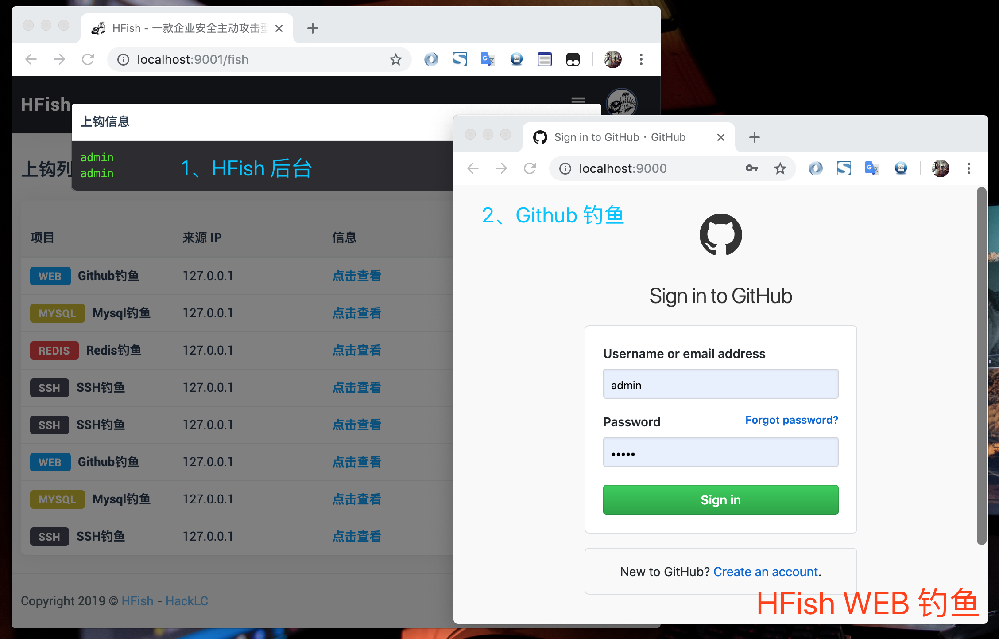

# 介绍

> *本 Team 研发此平台，仅为企业安全测试使用，禁止其他人员使用非法用途！一切行为与本 Team 无关。*

**HFish** 是一款基于 Golang 开发的跨平台多功能主动攻击型蜜罐钓鱼平台框架系统，为了企业安全防护测试做出了精心的打造

- 多功能 不仅仅支持 HTTP(S) 钓鱼，还支持 SSH、SFTP、Redis、Mysql 等
- 扩展性 提供 API 接口，使用者可以随意扩展钓鱼模块 ( WEB、PC、APP )
- 便捷性 使用 Golang 开发，使用者可以在 Win + Mac + Linux 上快速部署一套钓鱼平台

# 地址

- Github: https://github.com/hacklcs/HFish
- Download: https://github.com/hacklcs/HFish/releases

# 快速部署

### 部署说明

- 下载当前系统二进制包
- cd 到程序根目录，修改 config.ini 配置文件
- 执行 ./HFish run 启动服务
- 浏览器输入 http://localhost:9001 打开

### 帮助页面

### 启动服务

# 部分界面展示

# 部分功能使用演示

### WEB 钓鱼

### Redis 钓鱼

### Mysql 钓鱼

# 注意事项

- 邮箱 SMTP 配置后需要开启方可使用
- API 接口 info 字段，&& 为换行符
- 启动 WEB 钓鱼，请先启动 API 模块
- WEB 插件 需在 WEB 目录下 编写
- WEB 插件 下面必须存在两个目录

# TODO

- [x] 登录模块
- [x] 仪表盘模块
- [x] 上钩列表
- [x] 邮件群发
- [x] 命令行优化
- [x] 支持自定义 WEB 模板
- [x] 支持 Mysql 服务端获取连接客户端电脑任意文件
- [x] 支持 HTTP(S)、SSH、SFTP、Redis、Mysql 协议
- [ ] 支持 FTP、Telnet、SMTP、POP3、TFTP、Oracle、VPN 等
- [ ] 暗网钓鱼支持
- [ ] 自动化钓鱼支持
- [ ] 钓鱼报告生成
- [ ] 支持更多的 WEB 模块
- [ ] 日记完善优化
- [ ] 规划更多的功能...

# 关于

- Team: HackLC
- URL: https://hack.lc

# 反馈群

加微信拉人，请备注 **HackLC**

